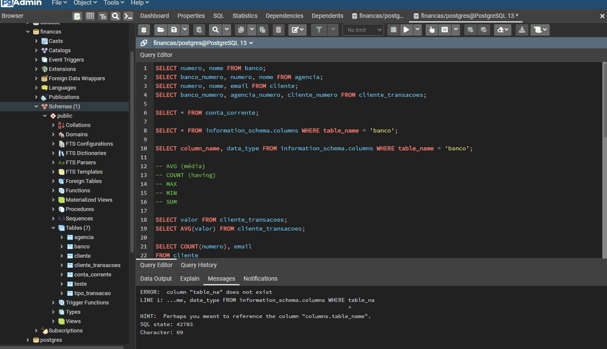
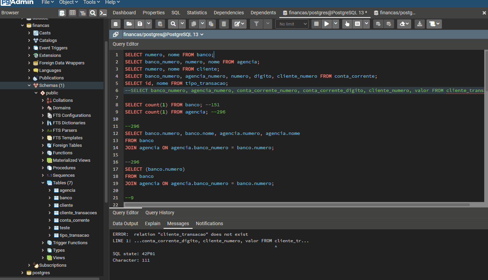
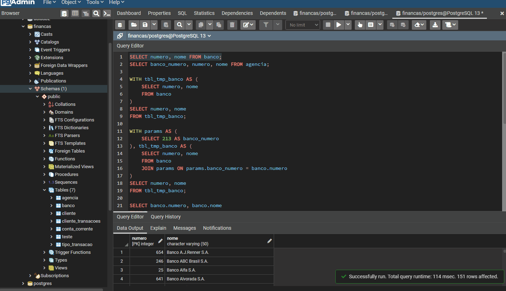
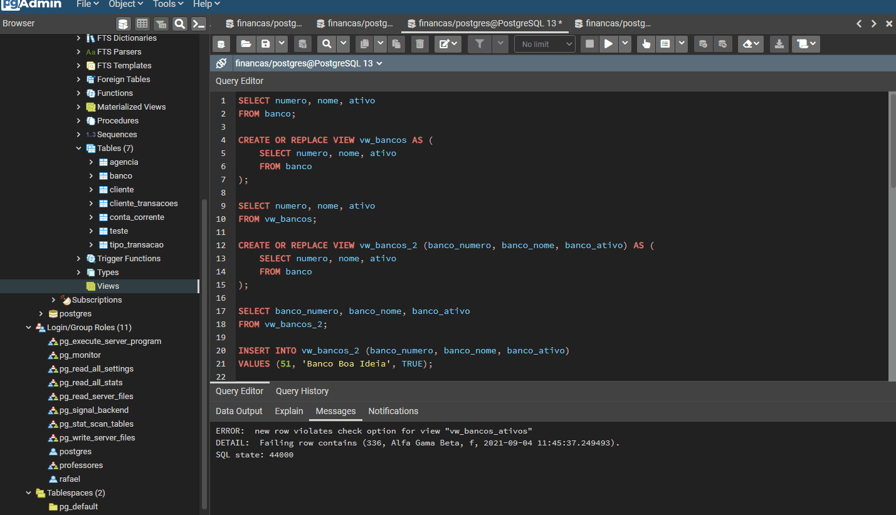
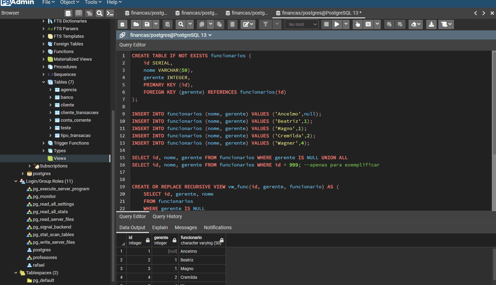
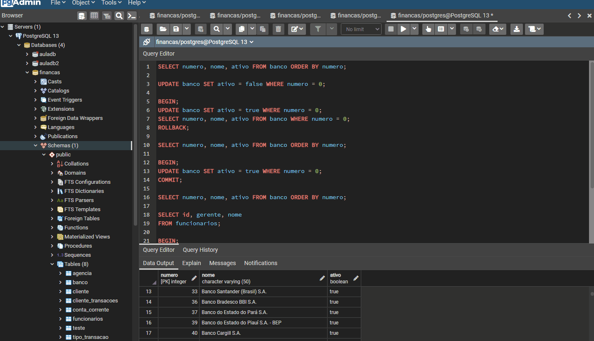

<h1 align="center">
  
   
  Financial Database Application
</h1>

<h3 align="justify">
Didactic application of a financial database, simulating a banking operation and some routines such as creating records, updating and queries using pgAdmin4. Credits for Digital Innovation One's PostgreSQL database concepts and best practices module.
</h3>

 

## 📷 Demonstration

<h4 align="left"> Creation, Feeding and Research </h4>
  
   
<h4 align="left" > Update </h4>  
  
   
<h4 align="left"> Functions </h4>
  
   
<h4 align="left"> Joins </h4>
  
   
<h4 align="left"> CTE </h4>
  
   
<h4 align="left"> Views </h4>
  
     
<h4 align="left"> Recursive View </h4>
  
     
<h4 align="left"> Begin </h4>
  

 

## 🚀 Technologies

This project was developed with the following technologies:

- PostgreSQL
- pgAdmin4

 

## ⚙ Settings
- TOOLS | Query Tool
- CREATE TABLE IF NOT EXISTS '';
- DROP TABLE IF EXIST '';
- INSERT INTO '' VALUES ('') ON CONFLICT ('') DO NOTHING;
- UPDATE '' SET = '' WHERE '';
- SELECT * FROM '';
- SELECT * FROM information_schema.columns WHERE table_name = '';
- SELECT column_name, data_type FROM information_schema.columns WHERE table_name = '';
- SELECT valor FROM ''| SELECT AVG('') FROM '';
- SELECT COUNT(''), '' | FROM ''| WHERE '' ILIKE '%""' | GROUP BY '';
- SELECT MIN('') | FROM '';
- SELECT MAX('') | FROM '';
- SELECT MIN('') | FROM '';
- SELECT MAX(''), '' | FROM '' | GROUP BY '';
- SELECT MIN(''), '' | FROM '' | GROUP BY '';
- SELECT column_name, data_type FROM information_schema.columns WHERE '' = '';
- SELECT COUNT('') --verificar registros duplicados | FROM '' | GROUP BY '' | HAVING COUNT('') > 150;
- SELECT SUM('') --soma todos os valores - acendente | FROM '' | GROUP BY '' | ORDER BY '' ASC;
- SELECT SUM('') --soma todos os valores - decrecente | FROM '' | GROUP BY '' | ORDER BY '' DESC;
- SELECT count(distinct '') | FROM '' | JOIN '' ON '' = '';
- SELECT '' | FROM '' | LEFT JOIN '' ON '' = '';
- SELECT '' | FROM '' | RIGHT JOIN '' = '';
- SELECT '' | FROM '' | FULL JOIN '' = '';
- WITH '' AS (SELECT '' AS '', | '' AS '', | '' AS '' | FROM '' | JOIN '' ON '' = '' | JOIN '' = '' | JOIN '' = '' AND '' ILIKE '%""%') | SELECT '' | FROM '';
- CREATE OR REPLACE VIEW '' AS ( | SELECT '' | FROM '');
- CREATE OR REPLACE RECURSIVE VIEW ''('') AS ('' |  FROM '' |	WHERE '' IS NULL | UNION ALL | SELECT '' | FROM '' | JOIN '' ON '' = '');
- BEGIN; | UPDATE '' = '' WHERE id = ''; | SAVEPOINT ''; | UPDATE '' = null; | ROLLBACK TO ''; | UPDATE '' SET '' = '' WHERE id = ''; | COMMIT;

 

---

Made with 💜 by Rafael Maciel
