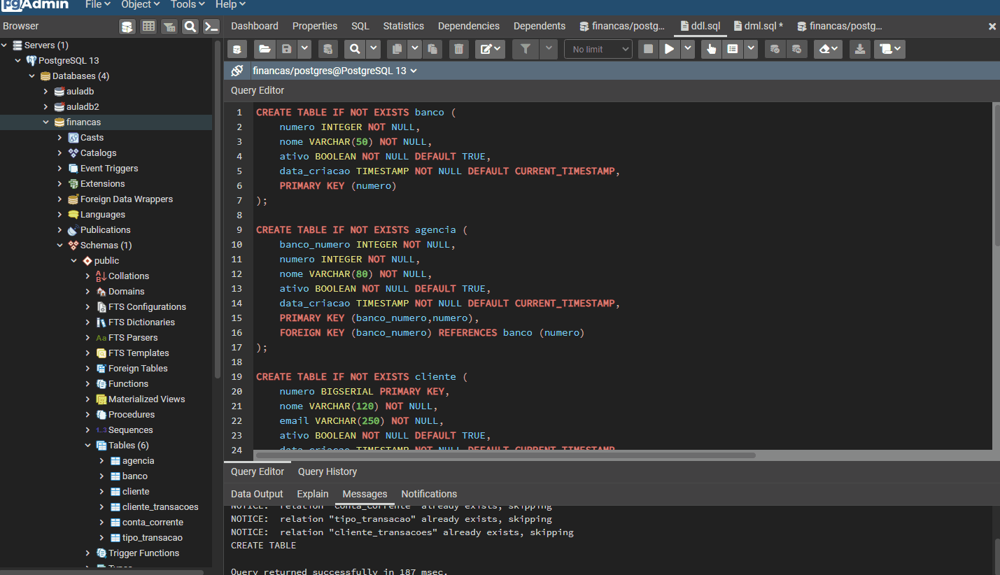
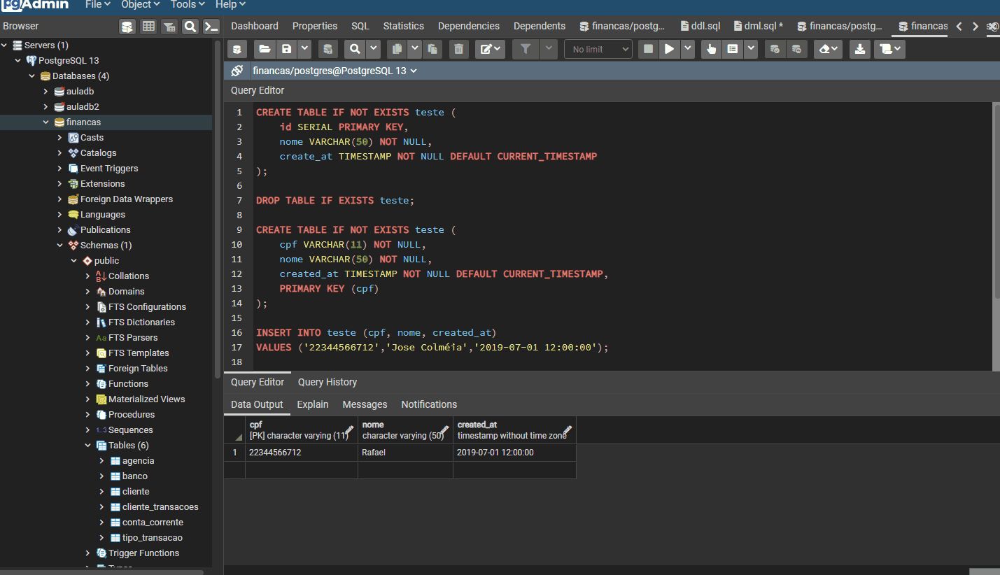

<h1 align="center">
  
   
  Financial Database Application
</h1>

<h3 align="justify">
Didactic application of a financial database, simulating a banking operation and some routines such as creating records, updating and queries using pgAdmin4. Credits for Digital Innovation One's PostgreSQL database concepts and best practices module.
</h3>

 

## 📷 Demonstration

  
   
  

 

## 🚀 Technologies

This project was developed with the following technologies:

- PostgreSQL
- pgAdmin4

 

## ⚙ Settings
- CREATE TABLE IF NOT EXISTS "";
- DROP TABLE IF EXIST "";
- INSERT INTO "" VALUES ("") ON CONFLICT ("") DO NOTHING;
- UPDATE "" SET = "" WHERE "";
- SELECT * FROM "";
 

---

Made with 💜 by Rafael Maciel
